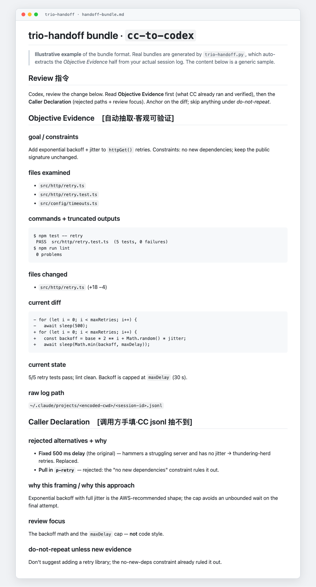

# trio-handoff

两个 AI 编码 agent 互相 review 时用的双向交接包。

为 **trio** 协作流程而建(一个人 + Claude Code 和 Codex 两个 agent),两个 agent 轮流互审。交接包格式可以扩展,但本仓库目前只内置 Claude Code 与 Codex 会话日志的抽取器。

> **范围说明。** 本仓库发布的是*交接包格式与抽取器*。
> 完整的 **trio 协议**(CC + Codex + 人三角制衡的协作流程:反向产品经理、
> 盲点扫描、谁写 / 谁审的路由)作为个人 skill 独立维护在
> `~/.claude/skills/trio/`,不在本仓库内。

## 为什么需要

当 agent A 让 agent B review 自己的工作时,A 通常只甩过去一个 diff 加一句话摘要。B 看不到 A 已经试过什么、检查过哪些证据、刻意否掉了哪些方案——于是 B 反复建议 A 早就排除的东西。

Cognition 的 [*Don't Build Multi-Agents*](https://cognition.ai/blog/dont-build-multi-agents) 点破了根因:**共享完整轨迹,而不只是消息。** 一段压缩过的消息载不动发送方的决策上下文。trio-handoff 是这条原则在"审稿交接"场景下的精确、可落地版本。

## 半抽取,半声明

一个交接包分两段:

**Objective Evidence(客观证据)**——从 agent 自己的 session 日志自动抽取:
目标 / 约束 · 检查过的文件 · 命令 + 截断输出 · 改动的文件 · 当前 diff · 当前状态 · 原始日志路径。

**Caller Declaration(调用方声明)**——由调用方手写,因为日志抓不到:
否掉的方案 + 为什么 · 为什么这样定义问题 / 选这条路 · 未决问题 · review 重点 · 没有新证据就别重提的建议。

**手写的那半才是最值钱的。** 否掉的方案和设计理由常常只存在作者脑子里——它们从没变成一个可观察的动作,所以任何脚本都抽不出来,必须主动声明。而这手写的一半,恰恰是阻止 reviewer 重复提你早否掉的建议的关键。



## 隐藏思维链绝不传

Claude 的 `thinking` 和 Codex 的 `reasoning` 按设计排除。隐藏的思维链里含被废弃的中间想法、且不可验证;reviewer 该锚定在可观察的证据上,而不是作者的内心独白。这里说的"完整轨迹"指**可观察的工作轨迹**(读了什么 / 跑了什么 / 改了什么),不是原始思维链。

## 两个方向,一套结构

| 方向 | 源日志 | 读 / 改通过 |
|---|---|---|
| `cc-to-codex` | Claude Code JSONL 会话 | `Read` / `Edit` / `Write` 工具 |
| `codex-to-cc` | Codex rollout transcript | `exec_command`(`cat`/`sed`)+ `apply_patch` |

结构相同,只是抽取器不同——因为两个 agent 观察自己工作的方式天生不同(Claude 有专门的读/改工具;Codex 靠 shell 命令读、靠 `apply_patch` 改)。

## 用法

```bash
./trio-handoff.py                          # 最近的 Claude 会话 -> 给 Codex 的包
./trio-handoff.py --direction codex-to-cc  # 最近的 Codex rollout -> 给 CC 的包
./trio-handoff.py path/to/session.jsonl    # 显式指定源,方向自动检测
./trio-handoff.py --last-n 3               # 只保留最近 3 个用户回合
./trio-handoff.py --include-subagents      # 带上子 agent 轨迹(cc-to-codex)
./trio-handoff.py --repo ~/code/project    # 在哪个 repo 跑 git diff / status
./trio-handoff.py --base origin/main       # diff 对比基线(含已 commit 的改动)
./trio-handoff.py --out /path/bundle.md    # 输出路径(默认 ~/Desktop/)
./trio-handoff.py --check bundle.md        # 发出前自查:Caller Declaration 是否还是空模板
./trio-handoff.py --allow-empty            # 抽取为空时仍生成(默认拒绝生成空壳包)
```

"最近的会话"按 **JSONL 内部时间戳**选取而不是文件 mtime(bridge / patch 进程会批量刷新 mtime,让 mtime 排序退化成抽签),且 Claude 会话扫描覆盖 `~/.claude/projects/*/` **全部**子目录(session 按 cwd 散落)。选源后会打印该会话的首条用户输入,让你一眼核对抓对了没有——不对就显式传 source 路径重跑。抽取结果为空时(选错源 / 格式漂移)拒绝生成空壳包。

输出是一个 Markdown 交接包(默认在 `~/Desktop/`)。**发出去之前先填好 Caller Declaration**,然后对包跑一次 `--check`——`rejected alternatives` 还空着时它会以非零码退出。把路径交给负责 review 的 agent——它读这个包作为导览,也能下钻到文末的原始日志路径核实任何一条,不必盲信压缩。

交接包开头带一句 review 指令:

> 第一动作先跑 repo anchors 里的 verify 命令核对现实(文档可能过时,命令输出不会);第二动作检查 Caller Declaration——还是空模板就打回,别基于半份交接开工。然后提取目标 / 证据 / 否掉的方案 / diff 再 review。没有新证据,就别重提已经否掉的建议。

## 安全边界

生成交接包时会对常见凭证做尽力而为的脱敏,包括私钥、JWT、主要服务商 token 形状、带账号密码的 URL、Authorization 请求头和常见密钥赋值。这是一层安全网,**不是完备的凭证扫描器**;跨信任边界发送前,仍要检查实际生成的 bundle。

源 JSONL 不会被修改,也不会复制进 bundle;bundle 里只保留本机路径作为下钻入口。能打开原始日志的人仍可能看到未经脱敏的源数据。先用 `--check` 检查声明完整性,再检查 bundle 本身是否含敏感信息,确认后再分享。

## 配置

| 环境变量 | 默认 |
|---|---|
| `TRIO_CC_DIR` | `~/.claude/projects`(两层扫描;也可指向单个 project 子目录) |
| `TRIO_CODEX_GLOB` | `~/.codex/sessions/*/*/*/rollout-*.jsonl` |

## 依赖

Python 3.8+,仅标准库。

## 版本

两条独立演进的版本线:

- **工具版本**: git tag,当前 **v2.5.0** —— 抽取器 / CLI 行为。
- **交接包模板版本**: 当前 **v1.13** —— 包内的段落结构。各字段带 `[v1.x]` 标记表示
  引入它的模板版本(repo anchors 的 verify 行是 v1.11;falsifier 和 exit criteria 是 v1.12;
  without-review baseline 是 v1.13;runtime surfaces 和 confidence 是 v1.10)。

本仓库发布的是交接包格式。trio 协议本身(CC + Codex + 人三角制衡的协作流程)
作为个人 skill 独立维护在 `~/.claude/skills/trio/`。

## 许可

MIT © 2026 AliceLJY · 见 [LICENSE](LICENSE)。English readme: [README.md](README.md)。
